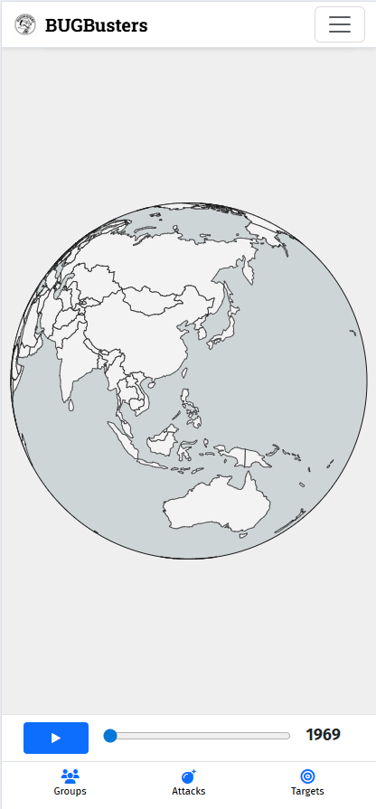
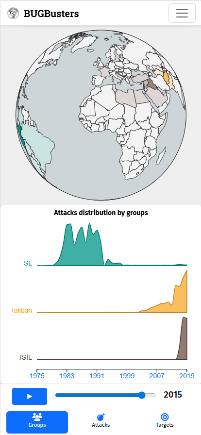
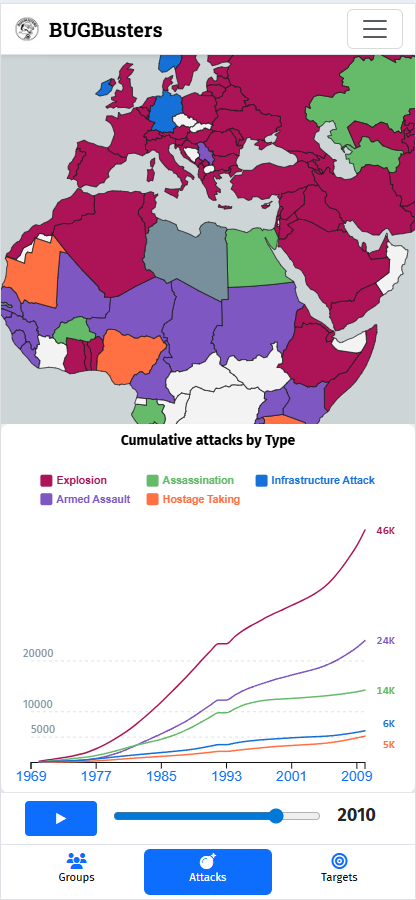
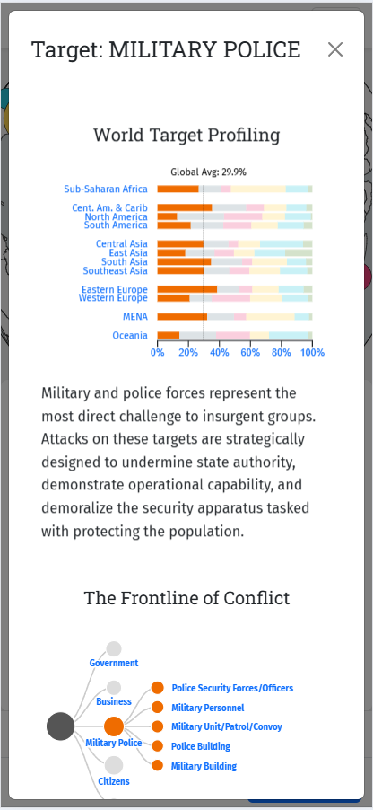

# BUGBusters: Visualizing Conflict and Human Suffering through Data

**BUGBusters** is a student team from the [University of Genoa](https://unige.it/en), composed of [Isabella Tagliafico](https://github.com/Isabibbi), [Luca Ninivaggi](https://github.com/supernino02), and [Flavio Barrara Stefani](https://github.com/FlavioBarraraStefani). This repository contains our interactive data visualization project developed for the university's Data Visualization course. 

The website aims to raise awareness and provide intuitive insights into the **[Global Terrorism Database (GTD)](https://www.start.umd.edu/data-tools/GTD)**. By using complex visual storytelling over a rich dataset of historical terrorist attacks, the goal is to make the raw data accessible, understandable, and deeply impactful. It uncovers trends regarding terrorist groups, targets, and methods used in attacks worldwide.

Both versions of the interactive single-page application are hosted on GitHub Pages:
- **[Final Mobile-Optimized Version](https://supernino02.github.io/Echoes-Of-Conflict/website.html)**: The completed version of the project, specifically optimized for visualization and interaction on mobile screens.
- **[Preliminary Desktop Version](https://supernino02.github.io/Echoes-Of-Conflict/old_website.html)**: An earlier version of the project, designed natively for larger monitors, featuring a slightly different layout.

See the dedicated READMEs inside the `website/` and `old_website/` directories for more technical details regarding directory structure, data pre-processing, and implementation specifics.

## How to Explore the Data

The interface features an interactive 3D globe that offers different visual perspectives based on the chosen category (Groups, Attacks, or Targets) from the bottom navigation bar. An interactive timeline slider allows users to watch how these global conflict trends evolve over time. 

By clicking on specific category instances—either directly on the globe or within the auxiliary plots below it—users can open a detailed, data-driven modal containing in-depth explanations and specialized charts for that specific entity.

### Interface Overview

**1. Base Navigation and Timeline**

**2. Visualizing Specific Categories (e.g., Terrorist Groups)**

**3. Tracking Trends Over Time (e.g., Attack Types)**

**4. In-Depth Detailed Explanations**

